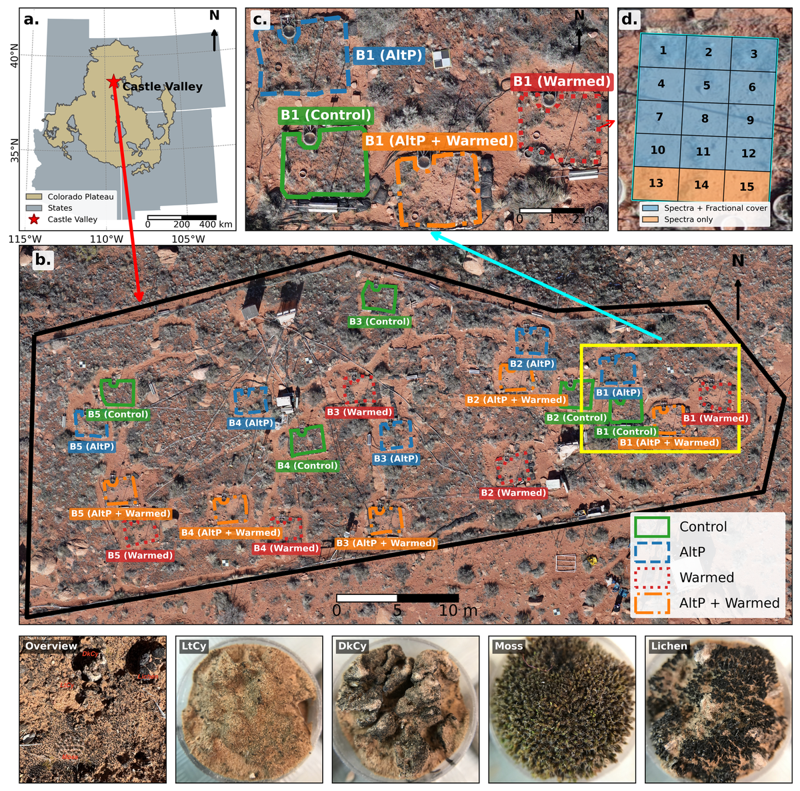
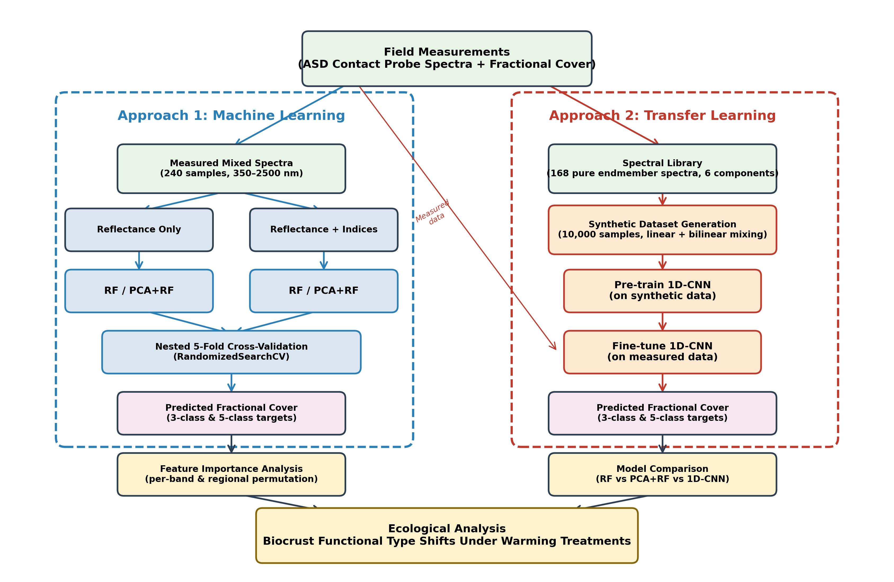

<div align="center">

<h1>Hyperspectral reflectance reveals climate change–driven successional regression in dryland biocrust communities</h1>

[Fujiang Ji](https://fujiangji.github.io/) <sup>1, *</sup>, [Sasha C. Reed](https://www.usgs.gov/staff-profiles/sasha-reed) <sup>2</sup>, [Miguel L. Villarreal](https://www.usgs.gov/staff-profiles/miguel-villarreal) <sup>3</sup>, [Cara Lauria](https://www.usgs.gov/staff-profiles/cara-marie-lauria) <sup>2</sup>, [William A. Rutherford](https://snre.arizona.edu/william-austin-rutherford) <sup>1, 4</sup>, [Min Chen](https://globalchange.cals.wisc.edu/staff/chen-min/) <sup>5</sup>, [Armin Howell](https://www.researchgate.net/profile/Armin-Howell) <sup>2</sup>, [William K. Smith](https://snre.cals.arizona.edu/people/william-smith) <sup>1</sup>

<sup>1</sup> School of Natural Resources and the Environment, University of Arizona, Tucson, AZ, USA  
<sup>2</sup> U.S. Geological Survey, Southwest Biological Science Center, Moab, UT, USA  
<sup>3</sup> U.S. Geological Survey, Western Geographic Science Center, Moffett Field, CA, USA  
<sup>4</sup> U.S. Department of Interior, Bureau of Land Management, Arizona State Office, Tucson, AZ, USA  
<sup>5</sup> Department of Forest and Wildlife Ecology, University of Wisconsin–Madison, Madison, WI, USA

</div>

<p align='center'>
  <a href="#"></a>
</p>

## Summary
* Biological soil crusts (biocrusts) are key components of dryland ecosystems, but climate-driven shifts in their composition remain difficult to monitor at ecologically relevant scales. Most remote-sensing studies emphasize categorical classification rather than continuous estimation of functional-type fractional cover within mixed pixels.
* We combined plot-level hyperspectral reflectance (350–2500 nm) from naturally mixed surfaces with a transfer-learning framework (1D-CNN pretrained on synthetic mixtures, fine-tuned on measured data) and Random Forest baselines to estimate biocrust fractional cover in a 20-year climate manipulation experiment at Castle Valley, Utah (Colorado Plateau).
* Under a successional-stage scheme, the fine-tuned 1D-CNN achieved _R²_ = 0.70 (early-successional, LtCy), 0.46 (late-successional, DkCy + Lichen + Moss), and 0.79 (senescent vegetation), consistently outperforming RF-based models. Under an individual biocrust functional type (BFT) scheme, prediction was strongest for lightly pigmented cyanobacteria (_R²_ = 0.70) and moss (_R²_ = 0.58), whereas darkly pigmented cyanobacteria and lichen remained difficult to estimate (_R²_ < 0.25) due to low abundance and strong spectral similarity.
* Feature-importance analysis identified visible-range pigment absorption bands as the dominant predictors, with additional contributions from the red-edge and shortwave-infrared regions. Model-estimated cover also reproduced the experimentally observed warming-driven successional regression: the combined warming + altered-precipitation treatment reduced measured late-successional cover by 37.3 ± 19.2% and increased early-successional cover by 36.3 ± 10.9%; the fine-tuned 1D-CNN captured the direction of these shifts with estimated changes of −20.3 ± 7.9% and +31.5 ± 7.3%, respectively.
* This study demonstrates that hyperspectral remote sensing can move biocrust studies beyond classification toward continuous fractional cover estimation, providing a foundation for scaling biocrust monitoring from field plots to landscapes using current and emerging hyperspectral missions (e.g., PRISMA, DESIS, EnMAP, EMIT, PACE, SBG, HiSUI, Tanager-1).

## Description of data
The `0_data/` folder contains the raw inputs used in this study:
* `ASD_Spectra/ASD_All_Spectra_PlotLevel.csv` — Plot-level mixed-pixel reflectance (350–2500 nm, 1 nm sampling), 300 spectra across four treatments × five replicate blocks.
* `ASD_Spectra/ASD_All_Spectra_ContactProbe.csv` — Pure endmember spectral library (168 spectra) for six biocrust functional types and surface components: DkCy (n=36), LtCy (n=36), lichen (n=36), moss (n=36), vegetation (n=9), litter (n=9).
* `USGS_Cover_Data/FractionaCover_BySpectra_2021_v2.csv` — Field-measured point-intercept fractional cover (USGS 2021).

**Note:** Processed measured mixtures and synthetic mixtures (~400 MB each for linear and bilinear) are not included in this repository due to size. Both can be regenerated locally by running the scripts in `1_data_processing/` and `3_synthetic_approach/`.


<p align="center"><b>Fig. 1.</b> Castle Valley long-term climate manipulation experiment at 38.67°N, 109.42°W, Colorado Plateau, Utah. Four treatments (Control, AltP, Warmed, AltP+Warmed) × five replicate blocks × 15 subplots per plot.</p>

## Modeling framework
This study uses two complementary modeling approaches:

* **Approach 1 — Random Forest regression**: trained directly on 240 paired measured mixed spectra and field-based fractional cover observations. Eight configurations are evaluated (RF vs. PCA+RF × 3-class vs. 5-class × reflectance only vs. reflectance + 10 spectral indices). Nested 5-fold cross-validation with `RandomizedSearchCV` (60 iterations) for hyperparameter tuning.
* **Approach 2 — Transfer learning (1D-CNN)**: pretrained on 10,000 synthetic mixed spectra generated from the pure endmember library using linear and bilinear mixing models (Dirichlet-distributed fractional abundances), then fine-tuned on the 240 measured spectra with 5-fold cross-validation. The CNN architecture has three convolutional blocks (32, 64, 128 filters; kernels 7, 5, 3) followed by adaptive average pooling and fully connected layers with dropout (p=0.3). Bilinear mixing produced higher accuracy than linear mixing and is reported as the final result.


<p align="center"><b>Fig. 2.</b> Methodological workflow combining Random Forest regression on measured mixed spectra and a 1D-CNN transfer-learning pipeline pretrained on synthetic mixtures and fine-tuned on measured data.</p>

## Requirements
* `python>=3.7`
* `numpy`, `pandas`, `scipy`, `scikit-learn`, `matplotlib`, `seaborn`
* `torch` (for 1D-CNN training)
* `geopandas`, `pyproj`, `gdal` (for Figure 1 only)

## Usage
* Clone this repository
  ```
  git clone https://github.com/FujiangJi/Castle_valley_biocrust.git
  cd Castle_valley_biocrust
  ```
* Generate processed input data (merge spectra with cover, compute 10 spectral indices)
  ```
  cd 1_data_processing && python process_measured_data.py
  ```
* Run RF / PCA+RF analyses (all 8 configurations × 3-class and 5-class schemes)
  ```
  cd ../2_rf_analysis
  python RF_analysis.py
  python RF_separate_feature_importance.py
  python RF_pure_endmember_classification.py
  ```
* Run the transfer-learning pipeline (example: bilinear mixing)
  ```
  cd ../3_synthetic_approach
  python synthetic_datasets_bilinear.py
  python pretrain_1DCNN_bilinear_3scheme.py   # repeat for _5scheme
  python finetune_1DCNN_bilinear_3scheme.py   # repeat for _5scheme
  ```
* Generate figures (Fig. 1–8 and supplementary figures)
  ```
  cd ../4_figure_plotting && python Figure3.py    # etc.
  ```
Outputs are written to `2_results/` (RF) and `3_results/` (CNN) directories, created at runtime.
All models use a fixed random seed (`random_state=42`) for reproducibility.

## Description of files in this repository
* **`0_data/`**: raw ASD spectra and USGS field fractional cover.
* **`1_data_processing/`**:
  * **[process_measured_data.py](1_data_processing/process_measured_data.py)**: merges plot-level spectra with USGS cover data; aggregates Litter + Live + Dead into a combined `frac_Vegetation`; computes 10 spectral indices (NDVI, PRI, NDNI, NDWI, MCARI, brightness index, moisture index, CI, SCAI, BSCI).
* **`2_rf_analysis/`**:
  * **[RF_analysis.py](2_rf_analysis/RF_analysis.py)**: runs all 8 RF / PCA+RF configurations sequentially.
  * **[RF_separate_feature_importance.py](2_rf_analysis/RF_separate_feature_importance.py)**: trains a separate RF per target to extract per-class feature importance.
  * **[RF_pure_endmember_classification.py](2_rf_analysis/RF_pure_endmember_classification.py)**: RF classification of pure endmember spectra to quantify the upper bound of spectral separability.
* **`3_synthetic_approach/`**:
  * **`synthetic_datasets_{linear,bilinear}.py`**: generate 10,000 synthetic mixed spectra.
  * **`pretrain_1DCNN_{linear,bilinear}_{3,5}scheme.py`**: pretrain the 1D-CNN (600 epochs, lr=0.001).
  * **`finetune_1DCNN_{linear,bilinear}_{3,5}scheme.py`**: fine-tune on measured data with 5-fold CV (500 epochs/fold, lr=0.0005).
* **`4_figure_plotting/`**:
  * **[Figure1.py](4_figure_plotting/Figure1.py)**: study area map and biocrust photos.
  * **[Figure2.py](4_figure_plotting/Figure2.py)**: spectral library, mixture spectra, and fractional cover distributions.
  * **[Figure3.py](4_figure_plotting/Figure3.py)**: model comparison scatter plots (3-class successional scheme).
  * **[Figure4.py](4_figure_plotting/Figure4.py)**: model comparison scatter plots (5-class BFT scheme).
  * **[Figure5.py](4_figure_plotting/Figure5.py)**: per-band feature importance (reflectance only).
  * **[Figure5_RF_indices.py](4_figure_plotting/Figure5_RF_indices.py)**: spectral-band vs. hyperspectral-index contribution (Fig. S1).
  * **[Figure5_comparison.py](4_figure_plotting/Figure5_comparison.py)**: pure endmember vs. mixed-pixel comparison (Fig. S2).
  * **[Figure6.py](4_figure_plotting/Figure6.py)**: spatial heatmaps + residuals, per block (3-class).
  * **[Figure7.py](4_figure_plotting/Figure7.py)**: spatial heatmaps + residuals, per block (5-class).
  * **[Figure8.py](4_figure_plotting/Figure8.py)**: treatment effects (measured vs. estimated, Δ from Control).
  * **[Figure_workflow.py](4_figure_plotting/Figure_workflow.py)**: methodological workflow diagram.

## Reference
In case you use our code or data in your research, please cite our paper:
```
Ji, F., Reed, S.C., Villarreal, M.L., Lauria, C., Rutherford, W.A., Chen, M., Howell, A.,
von Nonn, J., Smith, W.K. (under preparation). Hyperspectral reflectance reveals
climate change–driven successional regression in dryland biocrust communities.
```

## Contact
```
fujiang@arizona.edu
wksmith@arizona.edu
```

## Credits
* Field data and the Castle Valley climate manipulation experiment are supported by the U.S. Geological Survey (Southwest Biological Science Center) and the long-term ecological research community on the Colorado Plateau.
* This project is supported by the National Aeronautics and Space Administration (NASA) and U.S. Geological Survey programs supporting hyperspectral biocrust monitoring.
* We thank the broader Castle Valley research team for sustaining the long-term experiment that made this work possible.
